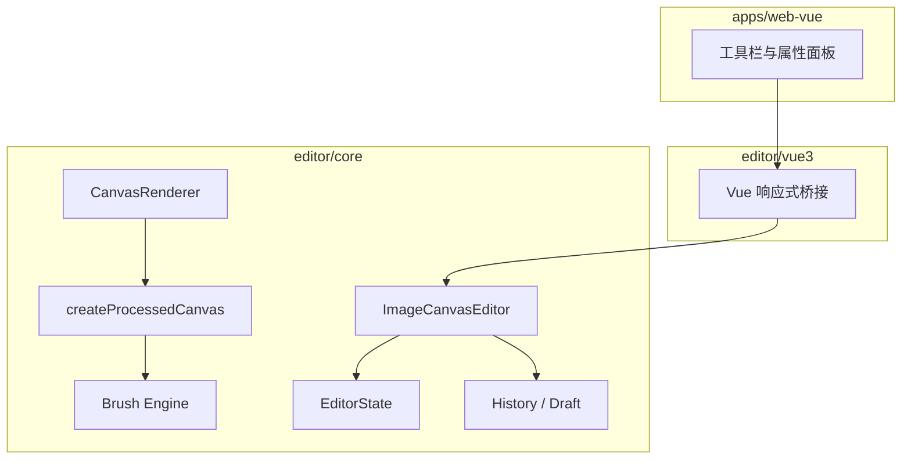
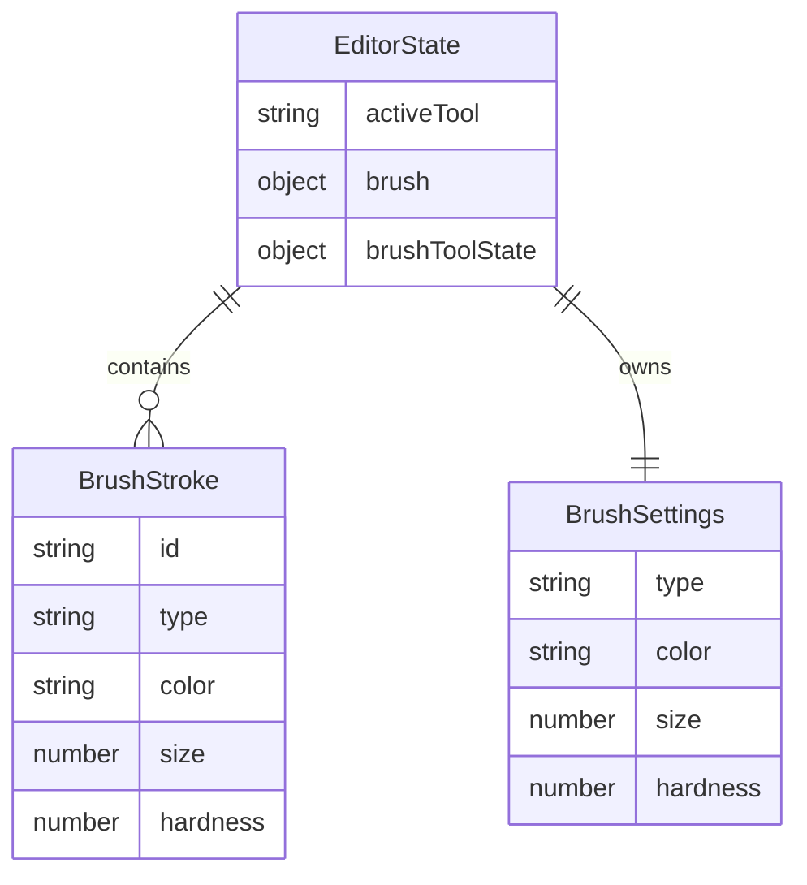

# 系统架构文档

## 文档信息
- **功能名称**：brush-layer
- **版本**：1.0
- **创建日期**：2026-04-09
- **作者**：Architect Agent

## 摘要

> 下游 Agent 请优先阅读本节，需要细节时再查阅完整文档。

- **架构模式**：浏览器端单体编辑器，沿用 `editor/core + editor/vue3 + apps/web-vue` 三层结构。
- **技术栈**：Vue 3 UI 壳 + TypeScript + Canvas 2D + 浏览器本地草稿持久化。
- **核心设计决策**：笔触以“原图坐标系比例点列表”存储；导出链路在底图调整后、几何变换前绘制画笔层；整笔绘制使用现有 preview/commit 历史机制。
- **主要风险**：旋转/裁剪后的坐标逆变换、历史记录颗粒度、与文字模式切换时的状态互斥。
- **项目结构**：新增画笔数据与绘制逻辑保留在 `editor/core`；`editor/vue3` 只做桥接；`apps/web-vue` 只负责面板和工具按钮。

---

## 1. 架构概述

### 1.1 系统架构图



### 1.2 架构决策

| 决策 | 选项 | 选择 | 原因 |
|------|------|------|------|
| 画笔存储 | 位图缓存 / 笔触列表 | 笔触列表 | 更容易兼容裁剪、旋转、撤销、草稿恢复 |
| 图层实现 | 直接改底图 / 独立画笔层 | 独立画笔层 | 不破坏底图，回滚和扩展成本更低 |
| 历史粒度 | 每个点一条历史 / 每笔一条历史 | 每笔一条历史 | 避免撤销爆炸，符合用户预期 |

---

## 2. 技术栈

| 层级 | 技术 | 版本 | 说明 |
|------|------|------|------|
| 前端框架 | Vue 3 | 仓库现有 | UI 壳和响应式绑定 |
| 渲染 | Canvas 2D | 浏览器原生 | 预览与导出合成 |
| 状态 | 自定义 `EditorStore` | 仓库现有 | 统一管理编辑状态 |
| 历史 | 快照历史 + preview/commit | 仓库现有 | 用于整笔撤销重做 |
| 持久化 | `localStorage` 草稿 | 仓库现有 | 浏览器本地恢复 |

---

## 3. 目录结构

```
editor/core/src/
├── editor.ts              # 画布交互、历史提交、工具切换
├── types.ts               # 画笔状态、笔触模型
├── brush-engine.ts        # 笔触回放与软硬边渲染
├── image-processing.ts    # 导出链路，底图 + 画笔层 + 变换 + 文字
├── history.ts             # 历史快照包含画笔层
└── persistence.ts         # 草稿存储包含画笔层

editor/vue3/src/
└── useImageEditor.ts      # 暴露画笔模式与参数更新方法

apps/web-vue/src/
├── App.vue                # 工具按钮与画笔面板
└── components/WorkbenchIcon.vue
```

---

## 4. 数据模型

### 4.1 核心模型



### 4.2 数据字典

#### `EditorState.brush`
| 字段 | 类型 | 必填 | 说明 |
|------|------|------|------|
| type | `pencil \| brush \| pen \| eraser` | 是 | 当前工具 |
| color | string | 是 | 当前颜色 |
| size | number | 是 | 笔刷大小 |
| hardness | number | 是 | 0-1 硬度 |

#### `EditorState.brushStrokes[]`
| 字段 | 类型 | 必填 | 说明 |
|------|------|------|------|
| id | string | 是 | 笔触 ID |
| type | BrushType | 是 | 本笔工具类型 |
| color | string | 是 | 本笔颜色 |
| size | number | 是 | 本笔大小 |
| hardness | number | 是 | 本笔硬度 |
| points | `BrushStrokePoint[]` | 是 | 原图坐标系比例点列表 |

---

## 5. 渲染与导出设计

### 5.1 渲染顺序
1. 从原图和裁剪区域生成工作画布
2. 应用滤镜预设
3. 应用亮度/曝光/高光调整
4. 在工作画布上回放画笔图层
5. 对工作画布做旋转/翻转
6. 在最终画布上绘制文字

这个顺序的好处：
- 画笔颜色不会被滤镜和调节二次污染
- 画笔会随着图片几何变换一起走
- 文字仍保持最上层

### 5.2 坐标策略
- 笔触点统一按原图比例坐标存储
- 预览绘制前，先根据当前裁剪区和预览缩放计算回放位置
- 画笔输入时，需要从“预览坐标”逆变换回“原图坐标”

### 5.3 软硬边实现
- 采用 radial gradient stamp 方式沿路径采样回放
- 不同工具通过 `flow / spacing / minHardness` 做默认观感区分
- 橡皮擦使用 `destination-out` 擦除画笔层

---

## 6. 交互状态机

### 6.1 主工具状态
- `navigate`：默认浏览/平移/文字选择
- `text`：文字插入与文字相关交互
- `brush`：画笔模式，鼠标按下进入笔触收集

### 6.2 画笔状态
- `idle`：等待下一笔
- `drawing`：按下后持续收集点，抬起时一次提交历史

### 6.3 与文字互斥规则
- 切到画笔模式时，若文字处于编辑态，先结束编辑
- 画笔模式下清空文字选中态，避免 UI 句柄污染
- 双击文字进入编辑只在非画笔模式下生效

---

## 7. 历史与草稿

### 7.1 历史
- `HistorySnapshot` 增加 `activeTool / brush / brushStrokes / brushToolState`
- 单笔绘制使用现有 `previewChange -> commitPreviewState` 机制
- 绘制中间点只存在预览态，抬笔后才形成历史记录

### 7.2 草稿
- `SerializableEditorState` 增加画笔配置和笔触数组
- 恢复草稿时重建画笔工具状态和独立图层数据

---

## 8. 测试策略

| 层级 | 目标 | 策略 |
|------|------|------|
| `editor-workflow.test.ts` | 工具切换、单笔历史、橡皮擦类型 | 通过 `PointerEvent` 驱动编辑器 |
| `history.test.ts` | 画笔快照与回滚 | 校验 capture/apply 结果 |
| `editor-text-state.test.ts` | 草稿序列化 | 校验 brush 字段写入 payload |
| 构建验证 | 包导出与 UI 集成 | `pnpm build` |

---

## 9. 风险与缓解

| 风险 | 可能性 | 影响 | 缓解措施 |
|------|--------|------|----------|
| 旋转后输入点映射错误 | 中 | 高 | 使用与导出一致的裁剪尺寸和几何逆变换 |
| 大量笔触导致回放开销增长 | 中 | 中 | 第一版限制为单层与基础笔触；必要时后续做缓存 |
| 工具切换导致状态互相污染 | 中 | 中 | 主动工具 `activeTool` 明确化，画笔/文字互斥 |

---

## 变更记录

| 版本 | 日期 | 作者 | 变更内容 |
|------|------|------|----------|
| 1.0 | 2026-04-09 | Architect Agent | 初始版本 |
