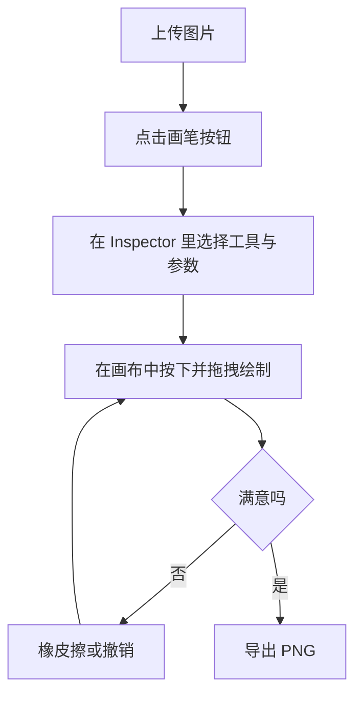

# UI/UX 规范文档

## 文档信息
- **功能名称**：brush-layer
- **版本**：1.0
- **创建日期**：2026-04-09
- **作者**：UI Designer Agent

## 摘要

> 下游 Agent 请优先阅读本节，需要细节时再查阅完整文档。

- **设计风格**：延续现有工作台的悬浮面板与深色工作区，不另起页面。
- **主色调**：沿用现有工作台变量，画笔主入口使用与文字工具同级的高亮按钮。
- **核心组件**：工具栏画笔按钮、Inspector 画笔面板、工具类型按钮组、大小/硬度滑杆、颜色选择器。
- **响应式断点**：沿用现有桌面侧栏和移动端抽屉模式。
- **设计系统**：不引入新 UI 库，复用现有 `btn-* / input-range / text-color-chip` 风格。

---

## 1. 设计概述

### 1.1 设计理念
画笔功能应像现有文字和裁剪一样，成为工作台中的一个自然工具，而不是额外弹出一个“迷你软件”。操作路径短，状态反馈清晰，参数面板只放第一版真正有价值的控件。

### 1.2 设计原则
- **简洁**：只暴露工具类型、大小、硬度、颜色
- **一致**：复用现有工具栏与 Inspector 视觉语言
- **可访问**：按钮可聚焦、颜色控件有禁用态说明
- **响应式**：桌面与移动端都走同一套面板结构

---

## 2. 用户流程

### 2.1 主流程

### 2.2 流程说明

| 步骤 | 页面/组件 | 用户行为 | 系统响应 |
|------|-----------|----------|----------|
| 1 | 左侧工具栏 | 点击画笔按钮 | 进入画笔模式，按钮高亮 |
| 2 | 右侧画笔面板 | 切换工具和参数 | 后续新笔触使用新参数 |
| 3 | 画布区域 | 按下并拖拽 | 即时显示笔触 |
| 4 | 历史按钮 | 撤销 / 重做 | 按整笔回退或恢复 |
| 5 | 导出 | 下载 PNG | 导出图包含画笔层 |

---

## 3. 设计令牌

### 3.1 颜色系统
- 继续使用现有 `--studio-*` CSS 变量
- 画笔工具激活态：沿用主强调色
- 颜色选择器：允许自由色 + 预设色
- 橡皮擦状态：颜色区禁用并显示说明文字

### 3.2 排版系统
- 保持现有 Inspector 文案层级
- 标题与辅助文案继续复用 `panel-title` 与现有 `text-[color:var(--studio-ink-muted)]`

### 3.3 间距系统
- 面板内继续使用 16px/24px 的现有区块节奏
- 参数块之间保持 `space-y-4`

---

## 4. 页面规范

### 4.1 页面：工作台画笔增强

#### 布局结构
- 左侧工具栏：新增画笔按钮，与裁剪、文字同级
- 右侧 Inspector：新增“画笔” section，位置在“裁剪”和“文字”之间
- 中央画布：不新增额外浮层面板，直接在现有画布上绘制

#### 组件清单
| 组件 | 位置 | 说明 |
|------|------|------|
| 画笔入口按钮 | 左侧工具栏 | 进入/继续画笔模式 |
| 工具类型按钮组 | 右侧画笔 Section | 铅笔 / 画笔 / 钢笔笔刷 / 橡皮擦 |
| 大小滑杆 | 右侧画笔 Section | 1-160 px |
| 硬度滑杆 | 右侧画笔 Section | 0-100% |
| 颜色选择器 | 右侧画笔 Section | 原生色板 + 预设色 |

---

## 5. 组件规范

### 5.1 工具栏画笔按钮
- 与文字按钮同尺寸同层级
- 激活态使用 `dock-tool-btn--primary`
- 图标使用单色线性风格，与现有图标一致

### 5.2 工具类型按钮组
- 2 列排布，4 个按钮
- 激活工具使用 `btn-primary`
- 非激活使用 `btn-soft`
- 文案直接写工具名，不做图标堆叠

### 5.3 参数滑杆
- 复用现有 `input-range`
- 右侧显示当前数值
- 大小显示 `px`
- 硬度显示 `%`

### 5.4 颜色区
- 左侧原生颜色输入框
- 右侧复用现有预设色 chip
- 当工具为橡皮擦时，整个颜色区禁用

---

## 6. 动效与反馈

### 6.1 状态反馈
- 进入画笔模式后，Stage 顶部状态切换为“画笔模式”
- Stage Hint 提示“按下并拖拽即可绘制”
- 工具切换不弹 Toast，直接靠按钮状态和画布结果反馈

### 6.2 交互反馈
- 绘制过程中实时显示笔触
- 撤销后立即移除整笔
- 橡皮擦与普通画笔共享相同拖拽手感

---

## 7. 无障碍要求

- 画笔按钮需有 `aria-label`
- 工具类型按钮使用文本标签，便于读屏
- 禁用颜色区时应通过 `disabled` 表达状态
- 滑杆保留原生可访问语义

---

## 变更记录

| 版本 | 日期 | 作者 | 变更内容 |
|------|------|------|----------|
| 1.0 | 2026-04-09 | UI Designer Agent | 初始版本 |
