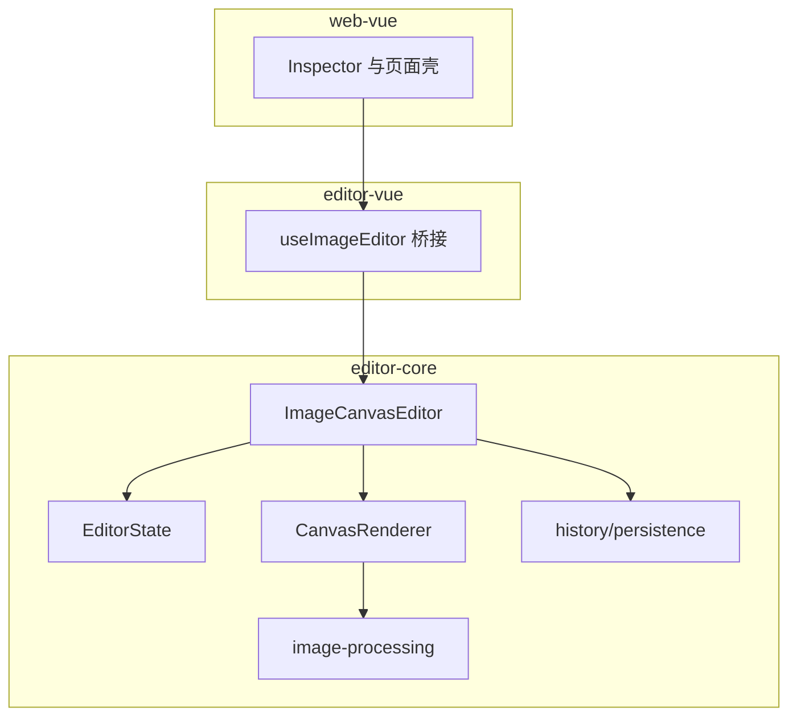
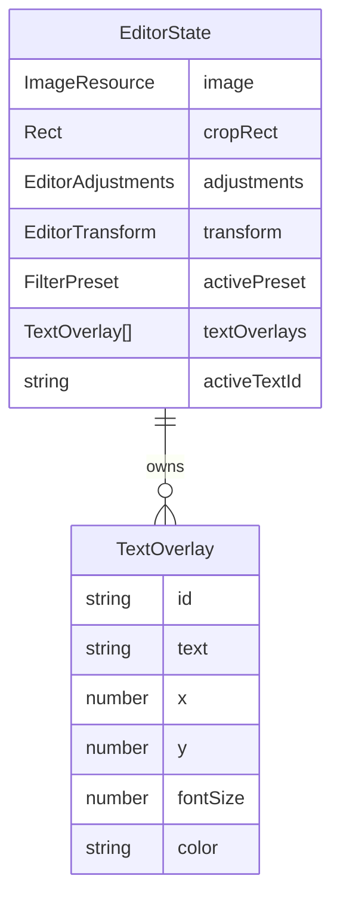
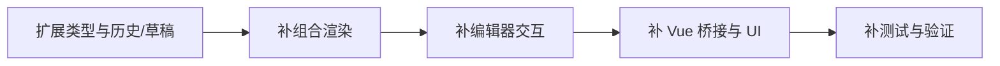

# 系统架构文档

## 文档信息
- **功能名称**：text-overlay
- **版本**：1.0
- **创建日期**：2026-03-27
- **作者**：Architect Agent

## 摘要

> 下游 Agent 请优先阅读本节，需要细节时再查阅完整文档。

- **架构模式**：前端单体 monorepo，继续沿用 `web-vue / editor-vue / editor-core` 三层分离。
- **技术栈**：Vue 3 + TypeScript + Canvas 2D，无新增框架，无后端。
- **核心设计决策**：文字状态存原图坐标系；渲染与导出共用一套组合管线；交互命中与拖拽在 `editor-core` 内完成。
- **主要风险**：坐标变换、历史快照扩展、拖拽与画布平移冲突。
- **项目结构**：主要变更集中在 `editor/core`，Vue 桥接层补暴露接口，Web 壳补一个文字检查器区块。

---

## 1. 架构概述

### 1.1 系统架构图



### 1.2 架构决策

| 决策 | 选项 | 选择 | 原因 |
|------|------|------|------|
| 覆盖层建模 | `textOverlay: null | object` / `textOverlays: []` | `textOverlays: []` | 即使本期 UI 只允许 0 或 1 个元素，内部数据结构仍保持统一，避免未来多文本时重做历史和渲染接口 |
| 坐标系统 | 画布坐标 / 视口坐标 / 原图坐标 | 原图坐标 | 裁剪、旋转、翻转、草稿恢复都以原图为稳定锚点，最不容易破坏兼容 |
| 渲染顺序 | 先画文字后变换 / 先变换图像再补字 | 在同一变换上下文中先画图再画文字 | 导出与预览保持一致，文字天然跟随裁剪和变换 |

---

## 2. 技术栈

| 层级 | 技术 | 版本 | 说明 |
|------|------|------|------|
| 前端框架 | Vue 3 | 仓库现有 | 保持不变 |
| UI 样式 | UnoCSS + 原生 CSS | 仓库现有 | 继续沿用现有工作台样式 |
| 编辑内核 | TypeScript + Canvas 2D | 仓库现有 | 文字状态、命中检测、拖拽、组合渲染都放在这里 |
| 数据存储 | localStorage | 仓库现有 | 草稿字段扩展为可选文字数据 |

---

## 3. 目录结构

```text
image-canvas-editor/
├── apps/web-vue/
│   └── src/App.vue                 # 新增文字检查器区块与提示
├── editor/core/
│   └── src/
│       ├── types.ts                # 文字覆盖层类型与状态
│       ├── history.ts              # 文字快照纳入撤销/重做
│       ├── persistence.ts          # 草稿序列化/恢复
│       ├── image-processing.ts     # 导出组合渲染
│       ├── renderer.ts             # 预览绘制与选中态
│       ├── editor.ts               # 文字交互、命中与拖拽
│       └── *.test.ts               # 文字渲染/历史相关单元测试
└── editor/vue3/
    └── src/useImageEditor.ts       # 暴露文字操作接口与派生状态
```

---

## 4. 数据模型

### 4.1 核心实体



### 4.2 数据字典

#### 实体：TextOverlay
| 字段 | 类型 | 必填 | 默认值 | 说明 |
|------|------|------|--------|------|
| id | string | 是 | 自动生成 | 覆盖层唯一标识 |
| text | string | 是 | `双击编辑文字` 或类似默认值 | 当前显示文本 |
| x | number | 是 | 基于原图宽度居中 | 原图坐标系下左上角 X |
| y | number | 是 | 基于原图高度居中 | 原图坐标系下左上角 Y |
| fontSize | number | 是 | 48 | 原图坐标系下字号 |
| color | string | 是 | `#ffffff` | CSS 颜色值 |

#### EditorState 扩展字段
| 字段 | 类型 | 必填 | 默认值 | 说明 |
|------|------|------|--------|------|
| textOverlays | `TextOverlay[]` | 是 | `[]` | 文字覆盖层集合，本期 UI 限制长度最多为 1 |
| activeTextId | `string \| null` | 是 | `null` | 当前选中的文字 |

---

## 5. 渲染与交互设计

### 5.1 渲染管线
1. 依据 `cropRect` 从原图裁出工作区域。
2. 对工作区域应用预设滤镜和像素级调节。
3. 在最终导出/预览的同一变换上下文中，先绘制处理后的位图，再绘制文字覆盖层。
4. 文字绘制时先从原图坐标减去 `cropRect` 偏移，再乘以缩放比例进入工作画布坐标。
5. 旋转与翻转作用于整张组合结果，因此文字与图片保持同一视觉变换。

### 5.2 预览交互
- 非裁剪模式下，优先判断鼠标是否命中文字边界框。
- 命中文字时进入文字拖拽模式，不再触发画布平移。
- 未命中文字时继续保持原有拖拽平移逻辑。
- 选中文字时，`CanvasRenderer` 额外绘制选中边框和提示文案。

### 5.3 坐标转换原则
- **持久化坐标**：原图坐标。
- **工作画布坐标**：`(overlay.x - cropRect.x) * scale`。
- **预览屏幕坐标**：基于组合结果尺寸与 `previewMetrics.displayWidth/Height` 再做一次缩放。
- **拖拽反算**：屏幕位移先还原为组合结果坐标位移，再通过逆旋转/逆翻转和裁剪缩放换回原图坐标位移。

---

## 6. 历史、草稿与兼容性

### 6.1 撤销/重做
- `HistorySnapshot` 增加 `textOverlays` 与 `activeTextId`。
- 文字新增、属性提交、拖拽结束都走 `commitChange`，保证进入历史栈。
- 文本输入滑动或拖拽中间帧不必每帧入栈，避免历史噪声。

### 6.2 草稿恢复
- `SerializableEditorState` 增加可选 `textOverlays`。
- 恢复旧草稿时若字段不存在，按空数组兼容。
- 恢复后保持无选中文字，避免旧草稿强行进入拖拽态。

### 6.3 兼容性边界
- 不改现有导出接口签名。
- 不改现有图片无文字时的渲染输出。
- 不改变裁剪模式的交互语义；裁剪模式下禁用文字编辑和拖拽。

---

## 7. 风险与缓解

| 风险 | 可能性 | 影响 | 缓解措施 |
|------|--------|------|----------|
| 旋转后拖拽方向和视觉方向不一致 | 中 | 高 | 使用逆变换把屏幕位移映射回原图位移，并为此补单元测试 |
| 文字边界框测量不准导致命中困难 | 中 | 中 | 统一使用离屏 canvas 和固定 `textBaseline = top` 的测量方式 |
| 新字段导致旧草稿解析失败 | 低 | 中 | 所有新增字段都设为可选并带默认值 |

---

## 8. 实施建议

### 8.1 开发顺序



### 8.2 里程碑
| 里程碑 | 内容 | 建议工时 | 风险等级 |
|--------|------|----------|----------|
| M1 | 类型、草稿、历史、导出渲染改造 | 0.5 天 | 中 |
| M2 | 预览命中、拖拽、选中态 | 0.5 天 | 高 |
| M3 | Vue UI 与测试补齐 | 0.5 天 | 中 |

---

## 变更记录

| 版本 | 日期 | 作者 | 变更内容 |
|------|------|------|----------|
| 1.0 | 2026-03-27 | Architect Agent | 初始版本 |
