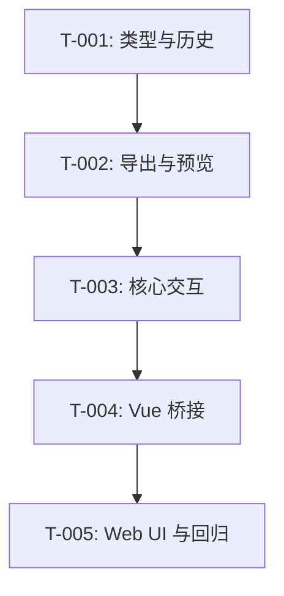

# 开发任务规格文档

## 文档信息
- **功能名称**：text-overlay
- **版本**：1.0
- **创建日期**：2026-03-27
- **作者**：Boss Pipeline
- **关联故事**：`.boss/text-overlay/prd.md`

## 摘要

- **任务总数**：5 个任务
- **前端任务**：2 个
- **后端任务**：0 个
- **关键路径**：类型扩展 -> 导出/历史 -> 画布交互 -> Vue 桥接 -> UI 验证
- **预估复杂度**：中

---

## 1. 任务概览

### 1.1 统计信息
| 指标 | 数量 |
|------|------|
| 总任务数 | 5 |
| 创建文件 | 0 |
| 修改文件 | 8 |
| 测试用例 | 6 |

### 1.2 任务分布
| 复杂度 | 数量 |
|--------|------|
| 低 | 1 |
| 中 | 4 |
| 高 | 0 |

---

## 2. 任务详情

### Story: S-001 - 单文本覆盖层落地

---

#### Task T-001：扩展核心类型与历史快照

**类型**：修改

**目标文件**：
| 文件路径 | 操作 | 说明 |
|----------|------|------|
| `editor/core/src/types.ts` | 修改 | 定义 `TextOverlay`，扩展 `EditorState` 与序列化状态 |
| `editor/core/src/history.ts` | 修改 | 让快照、比较、恢复支持文字层 |
| `editor/core/src/history.test.ts` | 修改 | 增加文字相关断言 |

**实现步骤**：

1. 在 `types.ts` 增加单文本结构，字段只保留本期真实需要的内容。
2. 在 `history.ts` 克隆、比较并恢复 `textOverlay`。
3. 在 `history.test.ts` 补文字快照测试，锁住撤销重做语义。

**测试用例**：

文件：`editor/core/src/history.test.ts`

| 用例 ID | 描述 | 类型 |
|---------|------|------|
| TC-001-1 | 快照包含文字层字段 | 单元测试 |
| TC-001-2 | 恢复历史时文字层正确回滚 | 单元测试 |

**复杂度**：中

**依赖**：无

**注意事项**：
- 不要把拖动中的瞬时态写进历史快照。
- 旧状态无文字层时必须兼容为 `null`。

**完成标志**：
- [ ] 代码实现完成
- [ ] 测试用例通过
- [ ] 代码符合规范

---

#### Task T-002：让文字参与导出与预览

**类型**：修改

**目标文件**：
| 文件路径 | 操作 | 说明 |
|----------|------|------|
| `editor/core/src/image-processing.ts` | 修改 | 在工作画布上绘制文字 |
| `editor/core/src/renderer.ts` | 修改 | 预览时显示文字和选中反馈 |

**实现步骤**：

1. 在底图处理完成后追加文字绘制函数。
2. 无文字层时直接跳过，保持旧行为。
3. 在 renderer 中添加轻量选中包围框或文字提示。

**测试用例**：

文件：`editor/core/src/image-processing.test.ts` 或现有相关测试文件

| 用例 ID | 描述 | 类型 |
|---------|------|------|
| TC-002-1 | 无文字层时输出不变 | 单元测试 |
| TC-002-2 | 有文字层时导出画布成功生成 | 单元测试 |

**复杂度**：中

**依赖**：T-001

---

#### Task T-003：补齐 editor 核心交互

**类型**：修改

**目标文件**：
| 文件路径 | 操作 | 说明 |
|----------|------|------|
| `editor/core/src/editor.ts` | 修改 | 新增文字创建、更新、拖动命中与裁剪兼容逻辑 |

**实现步骤**：

1. 增加 `ensureTextOverlay` / `updateTextOverlay` / `removeTextOverlay` 等动作。
2. 在普通模式下优先检测文字命中；未命中再继续现有画布平移。
3. 在裁剪模式下短路文字交互。
4. 拖动释放时提交历史，拖动过程只更新当前状态。

**测试用例**：

文件：`editor/core/src/editor.test.ts`（如未创建则新建）

| 用例 ID | 描述 | 类型 |
|---------|------|------|
| TC-003-1 | 创建默认文字层 | 单元测试 |
| TC-003-2 | 更新文字属性可提交 | 单元测试 |
| TC-003-3 | 裁剪模式下文字动作被禁用 | 单元测试 |

**复杂度**：中

**依赖**：T-001, T-002

---

#### Task T-004：桥接 Vue 层状态与动作

**类型**：修改

**目标文件**：
| 文件路径 | 操作 | 说明 |
|----------|------|------|
| `editor/vue3/src/useImageEditor.ts` | 修改 | 暴露文字状态、派生文案和动作 |

**实现步骤**：

1. 暴露 `hasTextOverlay`、`textOverlay`。
2. 暴露内容、字号、颜色更新方法。
3. 让 UI 层无需直接接触 core 内部结构细节。

**测试用例**：

文件：桥接层暂以类型检查和手工联调为主

| 用例 ID | 描述 | 类型 |
|---------|------|------|
| TC-004-1 | 文字相关 API 在组合式函数中可用 | 联调 |

**复杂度**：低

**依赖**：T-003

---

#### Task T-005：补 Web UI 与回归验证

**类型**：修改

**目标文件**：
| 文件路径 | 操作 | 说明 |
|----------|------|------|
| `apps/web-vue/src/App.vue` | 修改 | 新增文字检查器区块与提示 |
| `apps/web-vue/src/styles.css` | 修改 | 补充文字工具相关样式 |

**实现步骤**：

1. 新增“文字”区块，包含创建、内容、字号、颜色控件。
2. 接入禁用态与裁剪模式提示。
3. 回归验证上传、裁剪、滤镜、撤销重做、导出。

**测试用例**：

文件：手工验证

| 用例 ID | 描述 | 类型 |
|---------|------|------|
| TC-005-1 | 上传后可新增文字并拖动 | 手工测试 |
| TC-005-2 | 文字参与导出 | 手工测试 |
| TC-005-3 | 现有裁剪与滤镜不回归 | 手工测试 |

**复杂度**：中

**依赖**：T-004

---

## 3. 实现前检查清单

- [x] 已阅读相关 PRD 和架构文档
- [x] 已了解现有代码模式
- [x] 开发环境已配置
- [x] 依赖已安装（`pnpm install`）
- [ ] 分支已创建

---

## 4. 任务依赖图

---

## 5. 文件变更汇总

### 5.1 新建文件
| 文件路径 | 关联任务 | 说明 |
|----------|----------|------|
| `editor/core/src/editor.test.ts` | T-003 | 如当前不存在，则新增核心交互测试 |

### 5.2 修改文件
| 文件路径 | 关联任务 | 变更类型 |
|----------|----------|----------|
| `editor/core/src/types.ts` | T-001 | 扩展类型 |
| `editor/core/src/history.ts` | T-001 | 扩展快照 |
| `editor/core/src/history.test.ts` | T-001 | 补单元测试 |
| `editor/core/src/image-processing.ts` | T-002 | 合成文字 |
| `editor/core/src/renderer.ts` | T-002 | 预览反馈 |
| `editor/core/src/editor.ts` | T-003 | 新增交互 |
| `editor/vue3/src/useImageEditor.ts` | T-004 | 暴露桥接动作 |
| `apps/web-vue/src/App.vue` | T-005 | 新增 UI |
| `apps/web-vue/src/styles.css` | T-005 | 新增样式 |

### 5.3 测试文件
| 文件路径 | 关联任务 | 测试类型 |
|----------|----------|----------|
| `editor/core/src/history.test.ts` | T-001 | 单元测试 |
| `editor/core/src/editor.test.ts` | T-003 | 单元测试 |

---

## 6. 代码规范提醒

### TypeScript
- 使用严格类型
- 避免 `any`
- `textOverlay` 字段默认可空，避免人为构造哨兵对象

### Vue
- UI 层只调用桥接动作，不直接操作 core 状态结构
- 保持现有 `script setup` 与 `computed` 风格

### 测试
- 优先补 `editor/core/src/*.test.ts`
- 先锁历史与兼容，再做 UI 联调

---

## 变更记录

| 版本 | 日期 | 作者 | 变更内容 |
|------|------|------|----------|
| 1.0 | 2026-03-27 | Boss Pipeline | 初始版本 |
