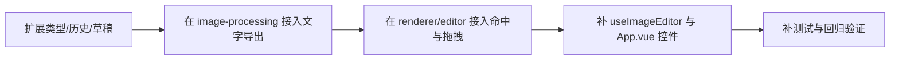

# 技术方案评审报告

## 1. 评审概述

- **项目名称**：text-overlay
- **评审日期**：2026-03-27
- **评审人**：Tech Lead Agent
- **评审文档**：
  - PRD：`.boss/text-overlay/prd.md`
  - 架构：`.boss/text-overlay/architecture.md`
  - UI 规范：`.boss/text-overlay/ui-spec.md`

## 摘要

> 下游 Agent 请优先阅读本节，需要细节时再查阅完整文档。

- **评审结论**：⚠️ 有条件通过
- **主要风险**：`textOverlays: []` 对单文本 MVP 过重；原图坐标 + 逆变换拖拽实现复杂度偏高；历史与草稿扩展最容易漏字段。
- **必须解决**：把数据结构收敛为 `textOverlay | null`；把坐标系收敛为“裁剪后工作画布坐标”；补齐历史、草稿、导出兼容测试。
- **建议优化**：命中框和拖拽逻辑保持近似单行模型，不要提前抽象图层系统。
- **技术债务**：如果未来真做多文本、旋转文字、富文本，当前单对象模型需要再演进。

---

## 2. 评审结论

| 维度 | 评分 | 说明 |
|------|------|------|
| 架构合理性 | ⭐⭐⭐⭐ | 保持三层边界是对的，但覆盖层数组和逆变换方案超出了当前 MVP 的必要复杂度。 |
| 技术选型 | ⭐⭐⭐⭐⭐ | 继续使用现有 Vue + Canvas 2D 管线，不引入新依赖，方向正确。 |
| 可扩展性 | ⭐⭐⭐ | 当前需求只有单文本，先做单对象更合适；未来扩展时再重构比现在过度设计更划算。 |
| 可维护性 | ⭐⭐⭐⭐ | 若按单对象 + 单坐标系收敛，可维护性高；若坚持数组 + 逆变换，维护成本明显上升。 |
| 安全性 | ⭐⭐⭐⭐⭐ | 文本只进入 Canvas 绘制，不引入 HTML 注入面。 |

**总体评价**：这是个真实需求，值得做；但文档里的实现路线有两处过度设计。更简单的方法是：**单文本对象 + 裁剪后工作画布坐标 + 与现有变换结果一起导出**。这样能更快交付，也更不容易破坏现有行为。

## 3. 技术风险评估

| 风险 | 等级 | 影响范围 | 缓解措施 |
|------|------|----------|----------|
| 把单文本建成 `textOverlays: []` 带来无意义的选择、遍历和快照复杂度 | 中 | `types.ts`、`history.ts`、`editor.ts`、`renderer.ts` | 本期改为 `textOverlay: TextOverlay \| null`，删除“活动 id”“数组长度限制”这类伪通用概念 |
| 使用原图坐标并在拖拽时做逆裁剪/逆旋转/逆翻转，导致交互容易错位 | 高 | `editor.ts`、`renderer.ts`、导出与预览一致性 | 本期改为“裁剪后、变换前”的工作画布坐标；文字先落在工作画布，再随整张结果一起变换 |
| 历史快照、草稿恢复漏掉新字段，造成撤销重做或恢复失效 | 高 | `history.ts`、`persistence.ts` | 为 `textOverlay` 增加默认空值兼容，并补单元测试覆盖旧草稿和快照恢复 |

## 4. 技术可行性分析

### 4.1 核心功能可行性

| 功能 | 可行性 | 复杂度 | 说明 |
|------|--------|--------|------|
| 单文本状态扩展 | ✅ 可行 | S | 只需给 `EditorState`、`SerializableEditorState`、`HistorySnapshot` 增加一个可空对象字段 |
| 文字参与导出 | ✅ 可行 | S | 在现有 `createProcessedCanvas` 内，像素处理后、最终变换前绘制文字即可 |
| 画布命中与拖拽 | ✅ 可行 | M | 基于预览矩形和文本包围盒做命中检测即可，不需要 DOM 覆盖层 |
| 裁剪、平移、草稿兼容 | ✅ 可行 | M | 核心是模式隔离和默认值兼容，现有结构足够承载 |

### 4.2 技术难点

| 难点 | 解决方案 | 预估工时 |
|------|----------|----------|
| 文本包围盒测量 | 用离屏 canvas 的 `measureText`，高度先按 `fontSize * 1.2` 近似 | 1 小时 |
| 文字拖拽与画布平移冲突 | 普通模式先命中文字，再决定进入文字拖拽还是画布平移 | 1-2 小时 |
| 旧草稿兼容 | 恢复时对缺失 `textOverlay` 字段回退为 `null` | 小于 1 小时 |

## 5. 架构改进建议

### 5.1 必须修改（阻塞项）

- [ ] **收敛数据结构**：把架构文档中的 `textOverlays: [] + activeTextId` 改成 `textOverlay: TextOverlay | null`，因为本期没有多文本需求，数组只会制造额外分支和快照复制。
- [ ] **收敛坐标系统**：不要把拖拽反算做到原图坐标。文字位置应基于“裁剪后、变换前”的工作画布坐标存储，这样渲染和命中只需一套线性缩放。
- [ ] **锁住兼容路径**：`history.ts` 和 `persistence.ts` 必须纳入 `textOverlay` 字段，并验证旧草稿恢复不报错。
- [ ] **模式隔离**：裁剪模式下禁用文字编辑和拖拽；普通模式下未命中文字时继续保持现有画布平移行为。

### 5.2 建议优化（非阻塞）

- [ ] 在 `renderer.ts` 为选中文字绘制轻量虚线框和提示标签，提升可发现性。
- [ ] 在 UI 提供“删除文字”按钮，让用户能回到完全无文字状态，减少恢复和重置的特殊分支。

## 6. 实施建议

### 6.1 开发顺序建议



### 6.2 里程碑建议

| 里程碑 | 内容 | 建议工时 | 风险等级 |
|--------|------|----------|----------|
| M1 | `types.ts`、`history.ts`、`persistence.ts`、`image-processing.ts` 接入单文本 | 0.5 天 | 中 |
| M2 | `renderer.ts`、`editor.ts` 完成命中、拖拽、提示和模式隔离 | 0.5 天 | 中 |
| M3 | `useImageEditor.ts`、`App.vue`、`styles.css` 补控件并完成测试 | 0.5 天 | 低 |

### 6.3 技术债务预警

| 潜在债务 | 产生原因 | 建议处理时机 |
|----------|----------|--------------|
| 单对象模型无法直接扩成多文本 | 本期为了压缩复杂度刻意不做通用图层系统 | 只有在明确出现“多文本/图层管理”需求时再重构 |
| 文本包围盒是近似值 | Canvas 文本测量对不同字体和多行排版不精确 | 需要多行、字体切换或旋转文字时 |

## 7. 代码规范建议

### 7.1 目录结构规范

```text
只改现有层级：
- editor/core/src/types.ts
- editor/core/src/history.ts
- editor/core/src/persistence.ts
- editor/core/src/image-processing.ts
- editor/core/src/renderer.ts
- editor/core/src/editor.ts
- editor/core/src/*.test.ts
- editor/vue3/src/useImageEditor.ts
- apps/web-vue/src/App.vue
- apps/web-vue/src/styles.css
```

### 7.2 命名规范

- **文件命名**：沿用现有文件，不为单文本新增无意义模块层。
- **组件命名**：Vue 组件继续使用 PascalCase。
- **函数命名**：文字相关动作统一使用 `add/update/remove/move` 语义前缀。
- **变量命名**：状态字段统一使用 `textOverlay`，避免 `textLayer`、`label`、`caption` 混用。

### 7.3 代码风格

- 先消除特殊情况，再写分支；不要为“未来也许会有多文本”提前设计复杂图层框架。
- 拖拽、命中、导出共用同一套文本度量规则，避免三处各算一遍。

## 8. 评审结论

- **是否通过**：⚠️ 有条件通过
- **阻塞问题数**：4 个
- **建议优化数**：2 个
- **下一步行动**：先按阻塞项修正架构路线，再进入实现；实现时严格验证撤销重做、裁剪模式、草稿恢复三条兼容链路。

---

**评审原则**：技术服务于业务，架构服务于团队。这个功能值得做，但不值得为一个单文本 MVP 提前背上图层系统的复杂度。
