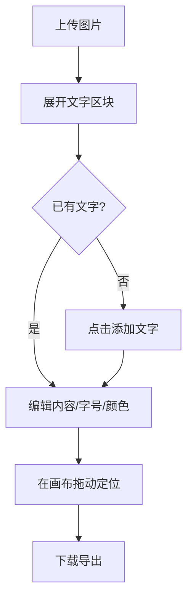

# UI/UX 规范文档

## 文档信息
- **功能名称**：text-overlay
- **版本**：1.0
- **创建日期**：2026-03-27
- **作者**：UI Designer Agent

## 摘要

> 下游 Agent 请优先阅读本节，需要细节时再查阅完整文档。

- **设计风格**：延续现有暖色深色工作台，在左侧 Inspector 中增加一个低噪音但可感知的“文字”区块。
- **主色调**：沿用现有 `--studio-accent` 与深褐背景，不新增第二套品牌色。
- **核心组件**：添加文字按钮、文本输入、字号滑杆、颜色选择器、删除按钮、画布选中提示。
- **响应式断点**：沿用当前移动端单列、桌面双列布局。
- **设计系统**：继续使用现有工作台按钮和区块样式，只补充文字区块局部样式。

---

## 1. 设计概述

### 1.1 设计理念
不重做页面，只在现有工作台上补一块真正有用的文字控制面板，让“加字”像现有裁剪和调色一样自然，不制造新的学习成本。

### 1.2 设计原则
- **简洁**：只有一组文字配置，不引入图层面板或复杂排版工具。
- **一致**：按钮、区块、说明文案沿用现有 Inspector 节奏。
- **可访问**：所有输入都有可见标签，颜色选择器和滑杆有禁用态。
- **响应式**：移动端仍保持单列阅读，避免控件过密。

---

## 2. 用户流程

### 2.1 主流程

### 2.2 流程说明

| 步骤 | 页面/组件 | 用户行为 | 系统响应 |
|------|-----------|----------|----------|
| 1 | 文字检查器 | 点击“添加文字” | 生成默认文字并选中 |
| 2 | 文本输入 | 修改内容 | 预览实时刷新 |
| 3 | 字号/颜色控件 | 调整样式 | 预览实时刷新 |
| 4 | 画布 | 拖动文字 | 显示选中边框并更新位置 |
| 5 | 下载按钮 | 导出 PNG | 输出包含文字的图片 |

---

## 3. 设计令牌

### 3.1 颜色系统

#### 主色调
| 名称 | 色值 | 用途 |
|------|------|------|
| Primary | `#e9c083` | 添加文字、激活态按钮、选中边框 |
| Primary Light | `#f2d3a0` | Hover/聚焦反馈 |
| Primary Dark | `#c89f61` | 按压和弱强调 |

#### 语义色
| 名称 | 色值 | 用途 |
|------|------|------|
| Success | `#22C55E` | 保存成功提示 |
| Warning | `#F59E0B` | 说明当前受限状态 |
| Error | `#EF4444` | 输入非法或恢复失败 |
| Info | `#3B82F6` | 辅助提示 |

#### 中性色
| 名称 | 色值 | 用途 |
|------|------|------|
| Surface 1 | `#1c1814` | 区块背景 |
| Surface 2 | `#231f1b` | 展开态区块背景 |
| Border | `rgba(255, 239, 220, 0.08)` | 边框 |
| Ink | `#f5efe7` | 主文字 |
| Ink Dim | `#a89f92` | 次级说明 |

### 3.2 排版系统

| 名称 | 大小 | 行高 | 字重 | 用途 |
|------|------|------|------|------|
| H3 | 20px | 1.4 | 600 | Inspector 区块标题 |
| Body | 16px | 1.5 | 400 | 输入框正文 |
| Small | 14px | 1.5 | 400 | 标签与辅助文案 |
| Caption | 12px | 1.4 | 400 | 交互提示 |

**字体族**：
- 中文：`"Source Han Sans SC", "Noto Sans SC", "PingFang SC", "Microsoft YaHei", sans-serif`

### 3.3 间距系统

基础单位：4px

| 名称 | 值 | 用途 |
|------|-----|------|
| spacing-2 | 8px | 紧凑控件间距 |
| spacing-3 | 12px | 标签与输入间距 |
| spacing-4 | 16px | Inspector 默认内边距 |
| spacing-6 | 24px | 区块内大间距 |

---

## 4. 页面规范

### 4.1 页面：编辑工作台

#### 布局结构
- 保持当前左侧 Inspector + 右侧画布结构不变。
- 在“参数调节”附近新增“文字”区块，建议放在“裁剪”和“滤镜预设”之间，便于理解为一种内容叠加而非色彩处理。

#### 组件清单
| 组件 | 位置 | 说明 |
|------|------|------|
| 文字区块标题 | 左侧 Inspector | 标题为“文字”，提示“单段文字覆盖层” |
| 添加文字按钮 | 文字区块首行 | 无文字时可用，有文字时切换为禁用 |
| 删除文字按钮 | 文字区块首行 | 有文字时可用，用于回到无文字状态 |
| 文本输入框 | 文字区块主体 | 单行输入，承载文字内容 |
| 字号滑杆 | 文字区块主体 | 范围输入，右侧显示当前字号 |
| 颜色输入 | 文字区块主体 | 原生 `input[type=color]` |
| 画布选中提示 | 画布右下/左下提示区 | 提示“拖动文字可移动位置” |

#### 响应式断点
| 断点 | 宽度 | 布局调整 |
|------|------|----------|
| 移动端 | `< 640px` | 按钮换行，文本输入和颜色选择垂直堆叠 |
| 平板 | `640px - 1279px` | 保持单列 Inspector |
| 桌面 | `>= 1280px` | 保持现有双列工作台 |

---

## 5. 组件规范

### 5.1 文字区块

#### 状态
| 状态 | 表现 |
|------|------|
| 空状态 | 显示“添加文字”主按钮和一段简短说明，编辑控件整体禁用 |
| 已创建未拖动 | 显示当前文字内容和样式控件，画布提示可拖动 |
| 选中状态 | 画布上出现高亮边框，区块标题或 hint 可用强调色 |
| 裁剪模式 | 所有文字控件禁用，并提示“请先退出裁剪模式” |

### 5.2 输入控件

#### 文本输入
| 项目 | 规格 |
|------|------|
| 类型 | 单行文本输入 |
| 高度 | 40px |
| 圆角 | 12px |
| 背景 | `var(--studio-surface-3)` |
| 边框 | `1px solid rgba(255,239,220,0.12)` |

#### 字号滑杆
| 项目 | 规格 |
|------|------|
| 范围 | 16 - 128 |
| 步进 | 1 |
| 反馈 | 右侧显示数值，拖动实时更新 |

#### 颜色输入
| 项目 | 规格 |
|------|------|
| 类型 | 原生颜色输入 |
| 尺寸 | 高 40px，最小宽 56px |
| 反馈 | 同步显示当前十六进制颜色值可选，但非必须 |

### 5.3 画布选中框
- 边框颜色：`var(--studio-accent)`
- 边框宽度：2px
- 四角不加手柄，本期只支持拖动不支持缩放
- 边框外附一个小提示标签：`文字 · 拖动可移动`

---

## 6. 动效规范

### 6.1 过渡时长
| 名称 | 时长 | 用途 |
|------|------|------|
| fast | 150ms | 按钮、输入聚焦 |
| normal | 220ms | 区块状态变化 |

### 6.2 动效约束
- 不新增花哨动画，只保留当前按钮和区块过渡节奏。
- 拖动文字时不做额外弹性动画，避免误导位置精度。

---

## 7. 无障碍要求

### 7.1 对比度
- 文字区块标题、输入标签与背景对比度维持现有工作台标准。
- 选中边框与深色画布底色保持足够区分。

### 7.2 键盘导航
- `Tab` 可到达添加按钮、删除按钮、文本输入、字号滑杆、颜色输入。
- 聚焦环沿用现有按钮的浅金色焦点样式。

### 7.3 屏幕阅读器
- 图标或仅颜色表达的控件必须有显式标签。
- 颜色输入应关联“文字颜色”标签。

---

## 变更记录

| 版本 | 日期 | 作者 | 变更内容 |
|------|------|------|----------|
| 1.0 | 2026-03-27 | UI Designer Agent | 初始版本 |
